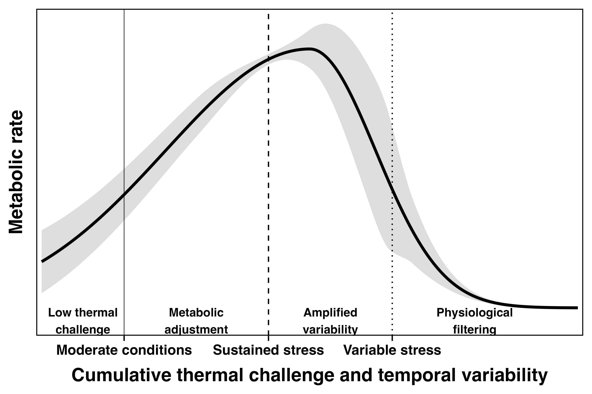

# Conceptual Figure 5: thermal exposure profiles and physiological variability

<p align="center">

  

</p>

This repository contains the R code used to generate Figure 5 for a manuscript on thermal exposure patterns and physiological plasticity in the sea urchin *Heliocidaris crassispina*.

## Purpose

Figure 5 presents a conceptual framework illustrating how cumulative thermal challenge and temporal variability may shape both mean metabolic performance and inter-individual physiological variability.

The solid line represents a conceptual average metabolic response, while the shaded ribbon represents variation among individuals within the population. The ribbon does not represent confidence intervals around the mean.

## Conceptual interpretation

The framework summarizes four conceptual regions:

1. **Low thermal challenge** — physiological responses remain relatively constrained under moderate conditions.

2. **Metabolic adjustment** — individuals increasingly upregulate metabolic activity as cumulative thermal challenge rises.

3. **Amplified variability** — temporally variable stress produces broader inter-individual physiological dispersion.

4. **Physiological filtering** — variability contracts as physiological tolerance limits are approached.

## Data-informed component

The mean response curve remains conceptual. However, the variability ribbon is informed by observed Day 28 respiration-rate variability measured across experimental thermal profiles.

The script calculates coefficients of variation from respiration summaries:

```r
cv = sd / mean
```

Lower variability estimates are taken from ambient and sustained-heating profiles, while higher variability estimates are taken from intermittent thermal profiles. This keeps the figure conceptual while transparently linking the ribbon to observed data.

## Required input file

Place this file in the working directory before running the script:

```text
Fig2A_summary_D28_by_profile.csv
```

Expected columns:

```text
Profile
Profile_lab
n
mean
sd
```

Profile codes used in the script:

```text
abt   = ambient/control profile
hws1  = long-duration/sustained heating profile
hws2  = 4-day cycle profile
hws3  = increasing-duration profile
hws4  = decreasing-duration profile
```

## R packages

Required packages:

```r
ggplot2
dplyr
readr
```

Install them with:

```r
install.packages(c("ggplot2", "dplyr", "readr"))
```

## Outputs

Running the script saves:

```text
Figure5_conceptual_profile_variability.pdf
Figure5_conceptual_profile_variability.png
```

The PDF is recommended for manuscript submission or further editing. The PNG is exported at 600 dpi for preview and general use.

## Note

This figure should be interpreted as a study-specific conceptual synthesis rather than an empirical model fitted to temperature-response data. The x-axis represents a conceptual gradient of cumulative thermal challenge and temporal variability, not measured temperature.
